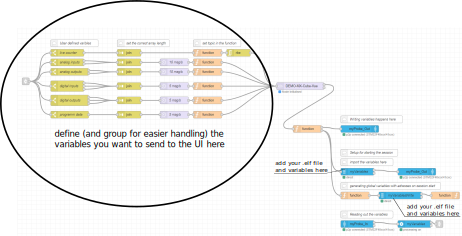
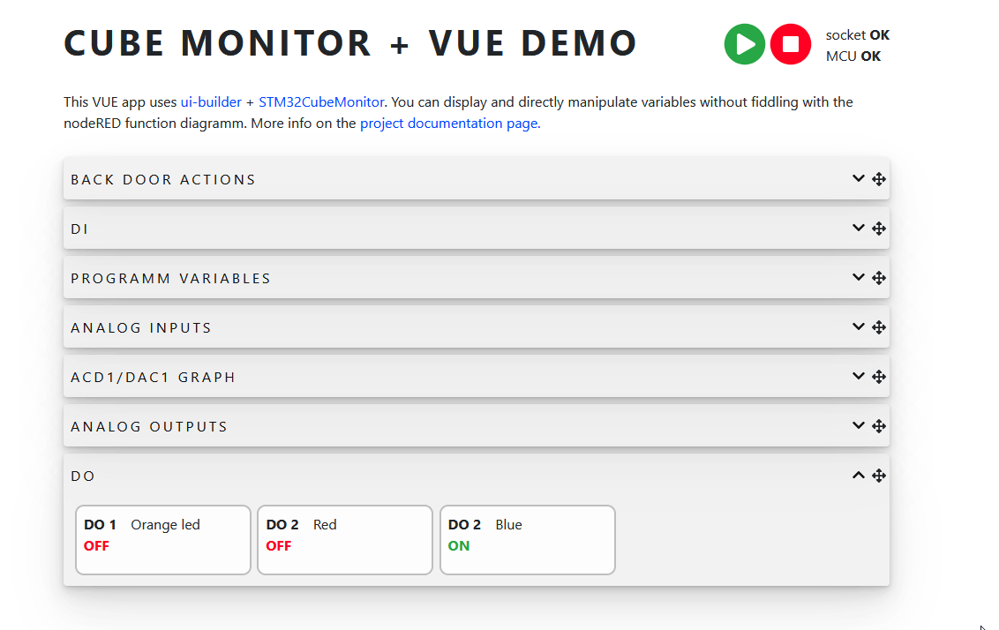
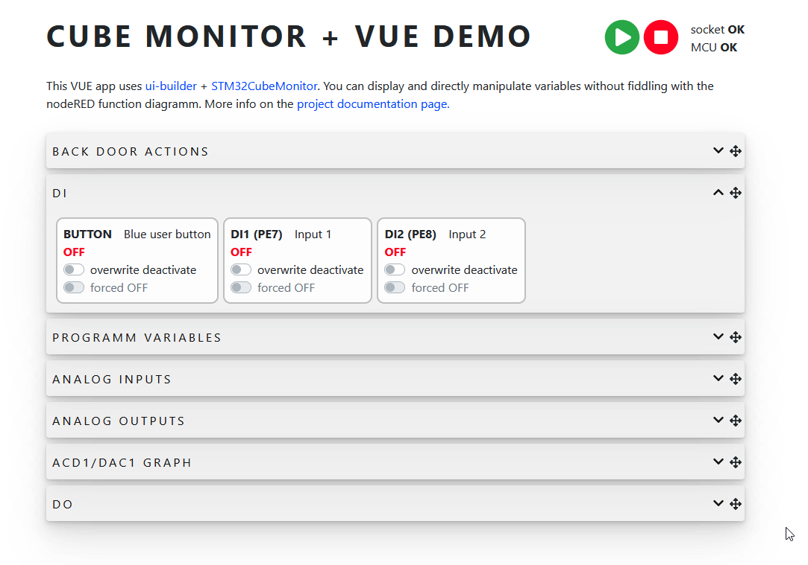
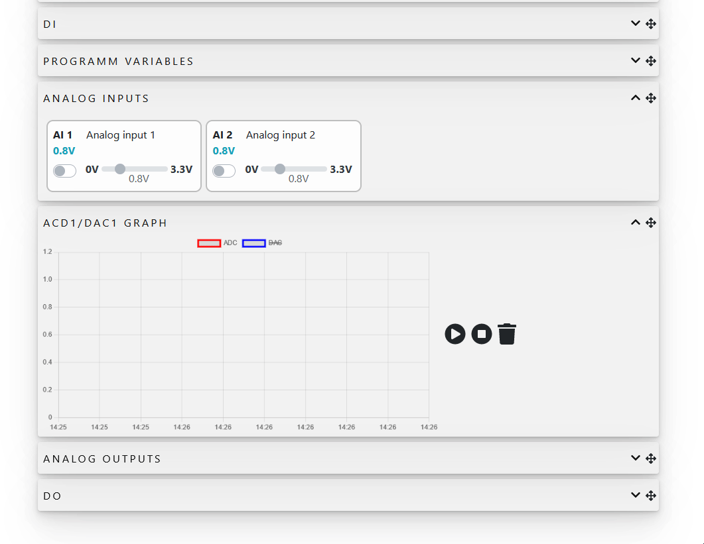
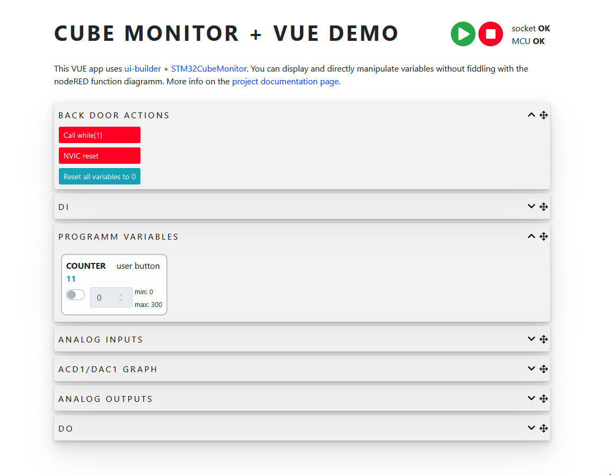

# DEMO CubeMonitor UI with Vue

Create dashboard to CubeMonitor application with custom UI elements with no minimal node-red diagram fiddling.

- This part contains the CubeMonitor JSON file and Vue UI source code. Check the documentation on [this repository github page](https://panvicka.github.io/CubeMonitor-VUE-Demo-CM/) 
- The second part with MCU program can be found here [CubeMonitor-VUE-Demo-MCU](https://github.com/panvicka/CubeMonitor-VUE-Demo-MCU)

This is how the NodeRed diagram looks like. You only need to adjust the left part of it to filter and variables that should be send to the UI.

## Monitor outputs online

## Monitor or rewrite inputs with forced values

## Plot graphs

## Create pre-defined actions to test your system

- define actions that will save you time when testing your system ()
- check how your system react to unexpected resets or endless loops (in the example is the watchdog not running)

## ...implement your own elements to make your embedded engineer life easier!

Documentation build: 
